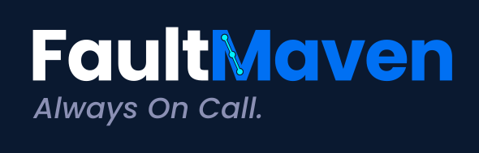

<p align="center">
  
</p>

<h1 align="center"></h1>

<p align="center">
  <strong>The AI-Powered Troubleshooting Copilot for Modern Engineering</strong>
</p>

<p align="center">
  Stop context-switching. Start fixing.
</p>

<p align="center">
  <a href="https://github.com/FaultMaven/faultmaven">
    
  </a>
  &nbsp;
  <a href="https://faultmaven.ai/founders">
    
  </a>
  &nbsp;
  <a href="https://faultmaven.ai">
    
  </a>
</p>

<p align="center">
  <a href="https://github.com/FaultMaven/faultmaven/blob/main/LICENSE">
    
  </a>
  <a href="https://www.python.org/downloads/">
    
  </a>
  <a href="https://fastapi.tiangolo.com/">
    
  </a>
</p>

---

## The Problem

Your monitoring tools tell you **what** broke. Generic LLMs guess **why**, but they can't see your infrastructure.

You end up copy-pasting logs into ChatGPT, losing context, and solving the same problems over and over.

**FaultMaven bridges this gap.**

---

## What Is FaultMaven?

An open-source AI copilot that connects your full stack—logs, metrics, traces, configs, and code—to a unified knowledge engine.

- **Deep Context Awareness** — Correlates your entire stack, not just error snippets
- **Tiered Knowledge Engine** — Global patterns + Team runbooks + Personal context
- **Zero Context-Switching** — Browser extension overlays intelligence on your existing tools
- **Continuous Learning** — Every resolved case becomes searchable institutional knowledge

---

## Quick Start

```bash
git clone https://github.com/FaultMaven/faultmaven.git && cd faultmaven
cp .env.example .env && ./faultmaven.sh start
```

**Dashboard:** http://localhost:3000 — **API:** http://localhost:8000

→ [Full deployment guide](https://github.com/FaultMaven/faultmaven#quick-start)

---

## System Architecture

FaultMaven uses a **modular monolith** architecture—a single FastAPI backend organized into feature modules with clear boundaries. This provides microservices-style modularity with monolith simplicity.

```
                    Browser Extension / Dashboard
                              |
                            HTTPS
                              v
+------------------------------------------------------------------+
|                   FaultMaven API (Port 8000)                    |
|                                                                  |
|  +------------------------------------------------------------+  |
|  |                       API Layer                            |  |
|  |   /api/v1/agent   /api/v1/cases   /api/v1/knowledge       |  |
|  +------------------------------------------------------------+  |
|  |                     Service Layer                          |  |
|  |   AgentService  CaseService  KnowledgeService  AuthService |  |
|  +------------------------------------------------------------+  |
|  |                  Infrastructure Layer                      |  |
|  |   LLM Router   Persistence   Security   Observability      |  |
|  +------------------------------------------------------------+  |
+------------------------------------------------------------------+
         |                     |                     |
         v                     v                     v
    +--------+           +---------+           +----------+
    | Redis  |           |ChromaDB |           | SQLite/  |
    | (opt)  |           |(Vectors)|           | Postgres |
    +--------+           +---------+           +----------+
```

### Core Modules

| Module | Status | Description |
| :--- | :---: | :--- |
| **agent** | ✅ Active | Investigation orchestration, AI tools, OODA framework |
| **auth** | ✅ Active | Users, sessions, organizations, teams, RBAC |
| **case** | ✅ Active | Investigation cases and lifecycle management |
| **evidence** | ✅ Active | File uploads, metadata, storage adapters |
| **knowledge** | ✅ Active | Embeddings, vector search, RAG, knowledge items |
| **report** | ✅ Active | Report generation and recommendations |

---

## The Ecosystem

<table>
<tr>
<td width="50%" valign="top">

**✅ Active Repositories**

| Repository | Description |
| :--- | :--- |
| [faultmaven](https://github.com/FaultMaven/faultmaven) | Main API (modular monolith) |
| [faultmaven-copilot](https://github.com/FaultMaven/faultmaven-copilot) | Browser extension |
| [faultmaven-dashboard](https://github.com/FaultMaven/faultmaven-dashboard) | React 19 web UI |

</td>
<td width="50%" valign="top">

**🛠 Technology Stack**

| Layer | Technologies |
| :--- | :--- |
| Backend | Python 3.11+, FastAPI, AsyncIO |
| Frontend | React 19, TypeScript |
| LLM | OpenAI, Anthropic, Gemini, Groq, Ollama |
| Database | SQLite (local), PostgreSQL (cloud) |
| Vector DB | ChromaDB, sentence-transformers |

</td>
</tr>
</table>

<details>
<summary><strong>🔄 Legacy Microservices (Migrating to Monolith) →</strong></summary>

The following microservices are being consolidated into the main `faultmaven` modular monolith. They remain available for reference but are not required for new deployments.

| Service | Status | Migration Target |
| :--- | :---: | :--- |
| [fm-api-gateway](https://github.com/FaultMaven/fm-api-gateway) | 🔄 Migrating | Core API routing |
| [fm-agent-service](https://github.com/FaultMaven/fm-agent-service) | 🔄 Migrating | `agent` module |
| [fm-knowledge-service](https://github.com/FaultMaven/fm-knowledge-service) | 🔄 Migrating | `knowledge` module |
| [fm-case-service](https://github.com/FaultMaven/fm-case-service) | 🔄 Migrating | `case` module |
| [fm-evidence-service](https://github.com/FaultMaven/fm-evidence-service) | 🔄 Migrating | `evidence` module |
| [fm-auth-service](https://github.com/FaultMaven/fm-auth-service) | 🔄 Migrating | `auth` module |
| [fm-session-service](https://github.com/FaultMaven/fm-session-service) | 🔄 Migrating | `auth` module (sessions) |
| [fm-job-worker](https://github.com/FaultMaven/fm-job-worker) | 🔄 Migrating | Background tasks (APScheduler) |
| [fm-core-lib](https://github.com/FaultMaven/fm-core-lib) | 🔄 Migrating | Core infrastructure layer |

**Note:** The modular monolith provides the same functionality with simplified deployment and reduced operational overhead.

</details>

---

## Open Source & Cloud

FaultMaven runs on a single, deployment-agnostic **Core**. Choose the edition that fits your needs:

### FaultMaven Open Source (Self-Hosted)

**Best for:** Individuals, teams, and air-gapped environments

- **Full Control:** Run on your own infrastructure (Docker, local, or Kubernetes)
- **Privacy First:** All data stays on your hardware—never leaves your network
- **Build Your Own Knowledge:** Start with a clean slate and build a personal knowledge base tailored to your needs
- **Offline Capable:** Run entirely offline with local LLMs (Ollama, vLLM)
- **Free Forever:** Apache 2.0 license—no usage limits, no subscription fees

**Deploy in 5 minutes:** [Quick Start Guide](https://github.com/FaultMaven/faultmaven#quick-start)

### FaultMaven Cloud (SaaS)

**Best for:** Engineering teams requiring collaboration and institutional scale

- **Managed Infrastructure:** Production-grade Kubernetes, auto-scaling, zero-downtime updates
- **Pre-Built Intelligence:** Starts with a global knowledge base of industry-standard troubleshooting guides
- **3-Tier Knowledge Architecture:** Global + Team + Personal knowledge layers
- **Team Collaboration:** Shared runbooks, incident logs, institutional memory
- **Enterprise Security:** SSO (SAML/OIDC), SOC 2 ready

**Join the beta:** [Beta Founders Program](https://faultmaven.ai/founders)

### Comparison

| Feature | Open Source | Cloud |
|---------|-------------|-------|
| **Deployment** | Docker / Self-Hosted | Managed Kubernetes |
| **Knowledge Base** | Empty (user builds) | Pre-loaded global KB |
| **Knowledge Tiers** | Personal only | Global + Team + Personal |
| **Infrastructure** | User-managed (SQLite) | Fully managed (PostgreSQL, S3) |
| **LLM Support** | All providers + local | All cloud providers |
| **Security** | Local auth | SSO, RBAC, SOC 2 |
| **Cost** | Free forever | Free during beta |

---

## Get Involved

<table>
<tr>
<td align="center" width="33%">

### 🚀 Deploy

Self-host in 5 minutes.
Free forever.

**[Get Started →](https://github.com/FaultMaven/faultmaven#quick-start)**

</td>
<td align="center" width="33%">

### 🤝 Contribute

Code, docs, or ideas.
All welcome.

**[Contributing Guide →](https://github.com/FaultMaven/faultmaven/blob/main/docs/CONTRIBUTING.md)**

</td>
<td align="center" width="33%">

### 💬 Community

Questions, feedback,
show & tell.

**[Discussions →](https://github.com/FaultMaven/faultmaven/discussions)**

</td>
</tr>
</table>

---

## Key Features

### 1. Deep Context Awareness

Generic chatbots can't access your logs, configs, or deployments. FaultMaven correlates your **full stack context**—connecting errors with recent changes, configuration drift, and system state.

**Example:** A Kubernetes pod is crashlooping. ChatGPT gives generic advice. FaultMaven analyzes your pod logs alongside deployment YAMLs and recent changes—then identifies that a ConfigMap update 2 hours ago introduced an invalid environment variable.

### 2. Zero Context-Switching

The **[FaultMaven Copilot](https://github.com/FaultMaven/faultmaven-copilot)** browser extension overlays AI troubleshooting directly onto your existing tools—AWS Console, Datadog, Grafana, or localhost. No backend agents, webhooks, or complex integrations required.

**How it works:** FaultMaven lives in your browser, not your cluster. As you view logs in CloudWatch, traces in Datadog, or pods in the Kubernetes dashboard, the Copilot extension captures the relevant context and correlates it with your Knowledge Base in real-time.

### 3. The Knowledge Flywheel

Most troubleshooting knowledge is lost once the incident is closed. FaultMaven turns that lost data into a growing asset:

- **Seed with Runbooks:** Pre-load your existing runbooks and documentation so the AI knows your standard operating procedures from Day 1
- **Grow with Incidents:** As you troubleshoot, the AI learns. When a case is resolved, FaultMaven extracts the successful steps and root cause to automatically update the knowledge base
- **Result:** Your static documentation becomes a dynamic, self-improving engine. Today's incident solution becomes tomorrow's automated fix

### 4. Flexible Multi-LLM Support

FaultMaven is model-agnostic, giving you freedom to choose the best intelligence for your needs and budget:

- **Frontier Models:** OpenAI, Anthropic, Google Gemini for complex reasoning
- **Inference Providers:** Groq, Fireworks AI for low-latency responsiveness
- **Local & Open Source:** Ollama, vLLM for maximum data privacy and zero API costs
- **Model Routing:** Built-in fallback logic ensures high availability

---

<p align="center">
  <strong>FaultMaven</strong> — Your AI copilot for troubleshooting.
</p>

<p align="center">
  <sub>
    <a href="https://faultmaven.ai">Website</a> ·
    <a href="https://github.com/FaultMaven/faultmaven">Documentation</a> ·
    <a href="https://faultmaven.ai/founders">Beta Founders</a>
  </sub>
</p>
