<p align="center">
  
</p>

<h1 align="center">FaultMaven</h1>

<p align="center">
  <strong>The AI-Powered Troubleshooting Copilot for Modern Engineering</strong>
</p>

<p align="center">
  Stop context-switching. Start fixing.
</p>

<p align="center">
  <a href="https://github.com/FaultMaven/faultmaven-deploy">
    
  </a>
  <a href="https://faultmaven.ai">
    
  </a>
  <a href="https://faultmaven.ai/founders">
    
  </a>
</p>

<p align="center">
  <a href="https://github.com/FaultMaven/FaultMaven/blob/main/LICENSE">
    
  </a>
  <a href="https://github.com/FaultMaven">
    
  </a>
</p>

---

## The Problem
**The gap between "Monitoring" and "Fixing" is too wide.**

Your observability tools tell you *what* is broken. Generic LLMs guess *why*, but they're blind to your infrastructure. You end up copy-pasting logs into ChatGPT, losing context, and solving the same problems over and over.

**FaultMaven bridges this gap.**

Learn more: [Product Overview](https://faultmaven.ai/product) · [Use Cases](https://faultmaven.ai/use-cases) · [Architecture](https://github.com/FaultMaven/FaultMaven#architecture)

## What Is FaultMaven?
FaultMaven is an **open-source AI copilot** that connects your full stack—logs, metrics, traces, configs, and code—to a unified knowledge engine. It combines:

* **Deep Context Awareness** — Correlates your entire stack, not just error snippets.
* **Tiered Knowledge Engine** — Global patterns + Team runbooks + Personal context.
* **Zero Context-Switching** — Browser extension overlays intelligence on your existing tools.
* **Continuous Learning** — Every resolved case becomes institutional knowledge, automatically indexed and searchable. The system gets smarter about your infrastructure with every problem you solve.

The result: faster troubleshooting, institutional memory that compounds, and engineers who spend less time firefighting.

## Key Features
* 🔍 **Context-Aware Analysis:** Automatically correlates logs with relevant code commits and documentation.
* 🚀 **One-Click Deployment:** Full stack spins up in seconds with Docker Compose.
* 🔒 **Privacy-First:** Support for local LLMs (Ollama, vLLM) and air-gapped environments.
* 🧠 **Self-Learning:** The more you use it, the smarter the "Knowledge Service" becomes about your specific architecture.

---

## Quick Start

```bash
git clone https://github.com/FaultMaven/faultmaven-deploy.git && cd faultmaven-deploy
cp .env.example .env      # Add your OPENAI_API_KEY
./faultmaven start        # Validates env, starts all services
```

**Dashboard:** http://localhost:3000 — **API:** http://localhost:8090

Full deployment guide: [faultmaven-deploy](https://github.com/FaultMaven/faultmaven-deploy)

-----

## Architecture

```mermaid
graph TD
    %% Nodes
    subgraph Clients [CLIENTS]
        Ext[Browser Extension]
        Dash[Web Dashboard]
    end

    Gateway[API GATEWAY :8090<br/>Routing • Auth • Capabilities]

    subgraph Services [MICROSERVICES]
        direction LR
        Agent[Agent Service]
        Know[Knowledge Service]
        Case[Case Service]
        Evid[Evidence Service]
        Auth[Auth Service]
    end

    Data[(DATA LAYER<br/>PostgreSQL • ChromaDB • Redis)]

    %% Connections
    Ext --> Gateway
    Dash --> Gateway
    Gateway --> Agent & Know & Case & Evid & Auth
    Agent & Know & Case & Evid & Auth --> Data

    %% Styling
    style Gateway fill:#f9f,stroke:#333,stroke-width:2px
    style Data fill:#dbf,stroke:#333,stroke-width:2px
```



-----

## Repositories

### Core Platform

| Repository | Description |
| :--- | :--- |
| [FaultMaven](https://github.com/FaultMaven/FaultMaven) | Main repository — documentation, architecture, guides |
| [faultmaven-deploy](https://github.com/FaultMaven/faultmaven-deploy) | Docker Compose deployment — **start here** |

### Microservices

| Repository | Purpose |
| :--- | :--- |
| [fm-api-gateway](https://github.com/FaultMaven/fm-api-gateway) | Request routing, auth, capabilities API |
| [fm-agent-service](https://github.com/FaultMaven/fm-agent-service) | AI troubleshooting engine |
| [fm-knowledge-service](https://github.com/FaultMaven/fm-knowledge-service) | Semantic search, RAG |
| [fm-case-service](https://github.com/FaultMaven/fm-case-service) | Investigation tracking |
| [fm-evidence-service](https://github.com/FaultMaven/fm-evidence-service) | File/log uploads |
| [fm-auth-service](https://github.com/FaultMaven/fm-auth-service) | Authentication |
| [fm-session-service](https://github.com/FaultMaven/fm-session-service) | Session persistence |
| [fm-job-worker](https://github.com/FaultMaven/fm-job-worker) | Background task processing |

### Clients

| Repository | Description |
| :--- | :--- |
| [faultmaven-copilot](https://github.com/FaultMaven/faultmaven-copilot) | Browser extension — AI overlay for your tools |
| [faultmaven-dashboard](https://github.com/FaultMaven/faultmaven-dashboard) | Web UI — case management, knowledge base |

-----

## Open Core Model

FaultMaven follows an Open Box / Black Box philosophy:

| | Self-Hosted | Enterprise Cloud |
| :--- | :--- | :--- |
| **Philosophy** | Open Box — full transparency | Black Box — zero ops |
| **Hosting** | Self-hosted (Docker) | Managed SaaS |
| **Knowledge Base** | Start empty, build yours | Pre-loaded + Team KB |
| **LLM** | Bring your own keys | Optimized & managed |

## LLM Support

Works with your preferred provider:

| Provider | Models | Air-Gapped |
| :--- | :--- | :---: |
| **OpenAI** | GPT-4o, GPT-4 Turbo | — |
| **Anthropic** | Claude 3.5 Sonnet, Opus | — |
| **Ollama** | Any local model | ✅ |
| **vLLM** | Any local model | ✅ |

-----

## Contributing

We build in the open and welcome all contributions—code, documentation, bug reports, feature ideas, or just feedback.

**Ways to Contribute:**

- **Code:** Pick up a [`good-first-issue`](https://github.com/search?q=org%3AFaultMaven+label%3A%22good+first+issue%22+state%3Aopen) or propose a new feature
- **Documentation:** Improve guides, add examples, fix typos
- **Knowledge Base:** Contribute troubleshooting patterns for the Global KB
- **Testing:** Report bugs, test edge cases, improve test coverage
- **Community:** Answer questions in [Discussions](https://github.com/FaultMaven/faultmaven/discussions), help other users

See [CONTRIBUTING.md](https://github.com/FaultMaven/FaultMaven/blob/main/CONTRIBUTING.md) for detailed guidelines.

**Example workflow:**
```bash
# 1. Fork and clone a service repository
git clone https://github.com/YOUR_USERNAME/fm-agent-service.git
cd fm-agent-service

# 2. Run the full stack locally for testing
cd ../faultmaven-deploy && docker compose up -d

# 3. Make changes, test, submit PR
```

-----

## Get Involved

### 🚀 Deploy Now

Self-host the open source version. Free forever.
[github.com/FaultMaven/faultmaven-deploy](https://github.com/FaultMaven/faultmaven-deploy)

### 🌟 Beta Founders

Shape the product. Get early Cloud access.
[faultmaven.ai/founders](https://faultmaven.ai/founders)

### 📚 Learn More

Full documentation and guides.
[faultmaven.ai](https://faultmaven.ai)


